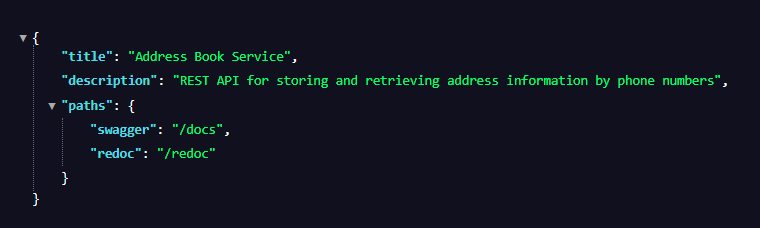
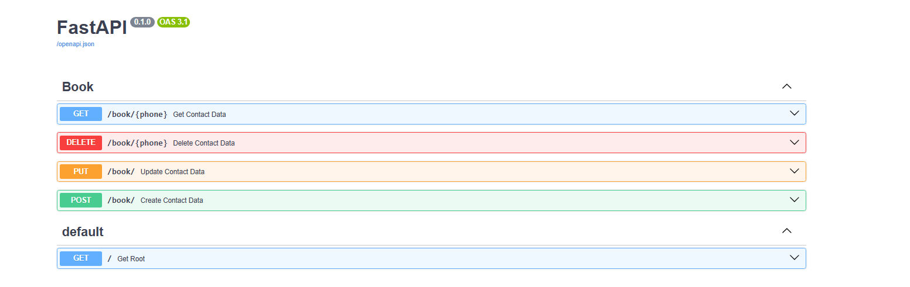

## Address Book Service

#### REST API for storing and retrieving address information by phone numbers

Address Book Service — это FastAPI-приложение для хранения и управления
адресными данными по телефонным номерам.
Данные хранятся в **Redis**, а сервис включает
полный набор CRUD-операций, валидацию данных, собственные ошибки и тестовый набор
на основе `pytest` + `fakeredis`.

---

## Возможности

- Создание записи (телефон → адрес)
- Получение адреса по номеру телефона
- Обновление существующей записи
- Удаление записи
- Нормализация телефонных номеров
- Обработка пользовательских ошибок (ServiceError, RepoError)
- Полное покрытие тестами (repositories, services, routers)
- Docker-окружение для локального запуска
- CI через GitHub Actions

---

## Технологии

- **FastAPI**
- **Redis / redis-asyncio**
- **Pydantic v2**
- **Poetry**
- **Pytest + pytest-asyncio + fakeredis**
- **Docker & Docker Compose**
- **GitHub Actions**

---

## Установка и запуск

### 1. Клонирование проекта

```bash
git clone git@github.com:AlexandrSmolyachkovGH/address_book.git
cd address_book
```

### 2. Настройка окружения
Создай файл .env:
```
REDIS_HOST=db_redis
REDIS_PORT=6379
REDIS_PASSWORD="address_book_RedisPwd123"
```

### 3. Запуск проекта в Docker
```
docker compose up --build
```

### 4. Приложение будет доступно на
```
http://localhost:8081
```


### 5. Документация Swagger UI
```
http://localhost:8081/docs
```

---

## API Endpoints
### POST /book/

Создать контакт (телефон + адрес)

Пример тела запроса:
```json
{
  "phone": "4951002030",
  "address": "Москва, ул. Тестовая, 10"
}
```
### GET /book/{phone}
Получить данные об адресе по номеру телефона

### PUT /book/

Обновить адрес по телефону
Пример тела запроса:
```json
{
  "phone": "4951002030",
  "address": "Москва, ул. Новая Тестовая, 25"
}
```

### DELETE /book/{phone}
Удалить запись по номеру
